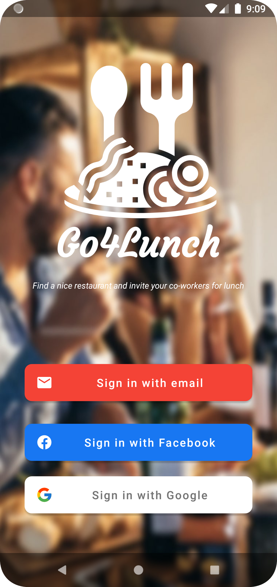
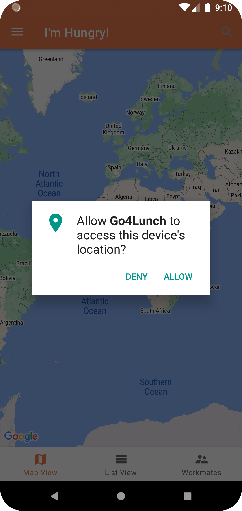
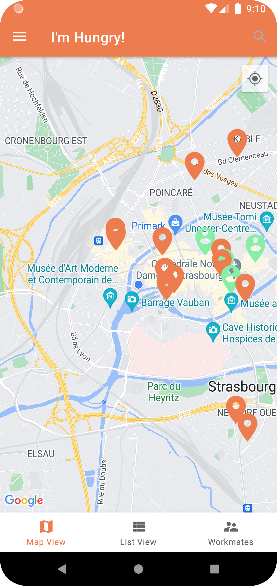
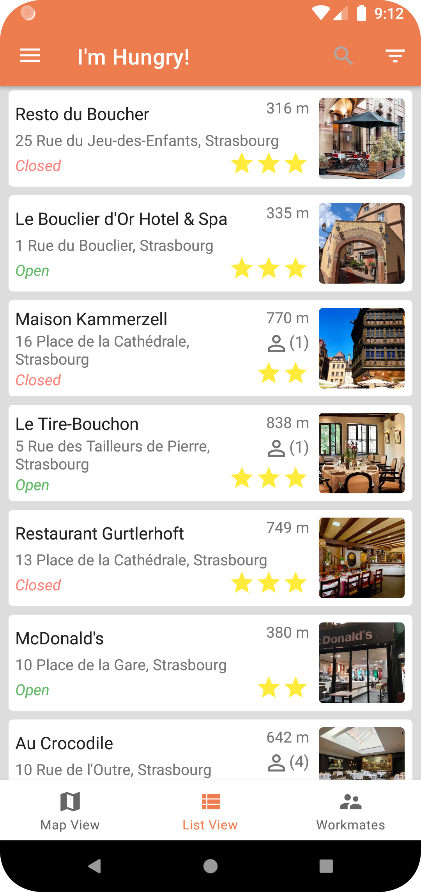
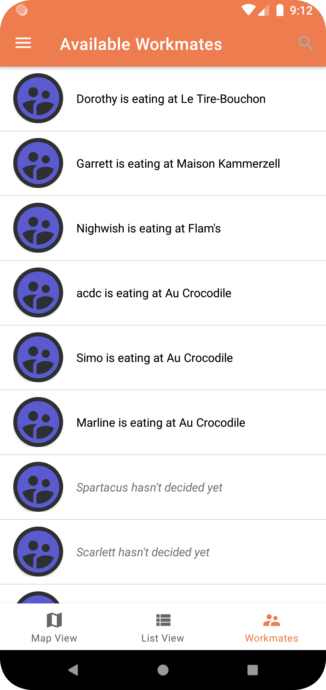
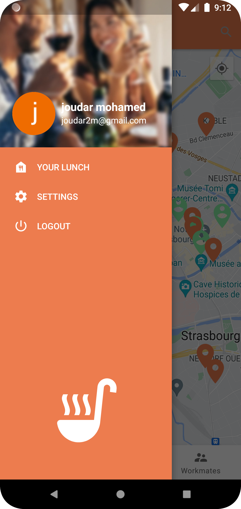
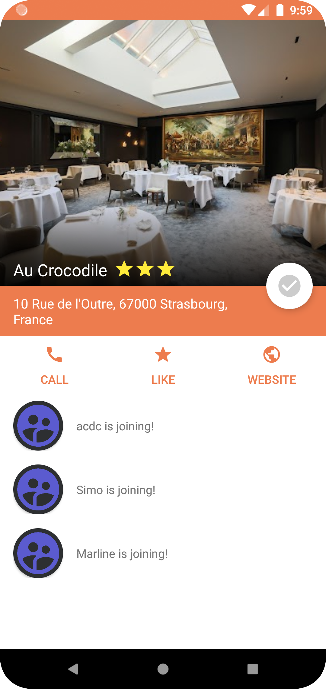
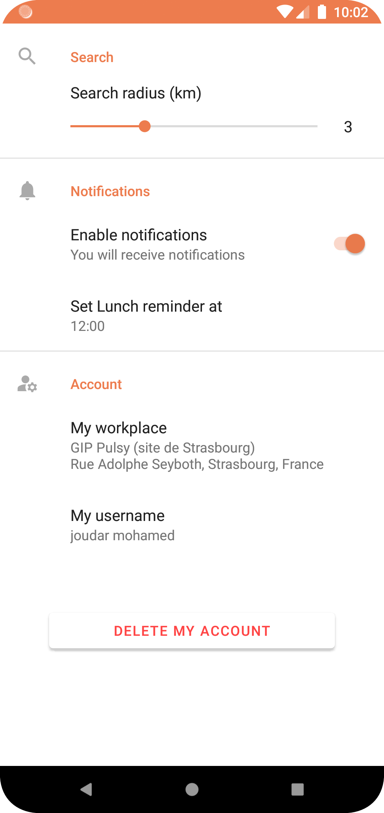

# Go4Lunch

## About
This is my seventh project for Openclassrooms' **Android App Development program**.
This **Native Android App "Go4Lunch"** is a lunch coordination app available for groups of colleagues to use in order to organize group lunch over their restaurant of choice.
The concept is simple: every user can declare which restaurant they're going to for lunch, so that all their colleagues on the app can see it and everybody can decide which one is joining who.
The source code package features also a folder "/Firestore" containing a **Diagram of Firestore DB structure** and **The DB access rules**.

## Testing
This source code package incorporates **unit tests** and **instrumentation tests** as well as **HTML results** of these tests.

## Installation
Clone/Download this repository and open it with **Android Studio**
```bash
git clone https://github.com/SimoJOUDAR/P5_Todoc.git
```

## Run the App
Once the project opened, you can run the App using Android studio's AVD to execute it.

## Obfuscation
The source code has obfuscation and shrinkResources enabled. It uses an external obfuscation dictionary available at https://bit.ly/3uGrnSu

## Generating signed APK
From Android Studio:
1. Go to ***Build*** menu
2. Go to ***Build Bundle(s) / APK(s)***
3. Click on ***Build APK(s)*** The APK generated can be loaded and run on any Android phone.

## Preview
   
   
  https://user-images.githubusercontent.com/80898080/192167705-a975de9e-9d35-4afa-bf39-7c2b5a7e385b.mp4
